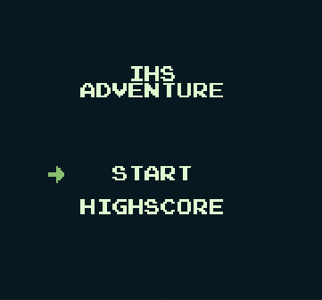
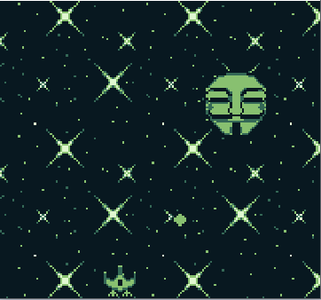
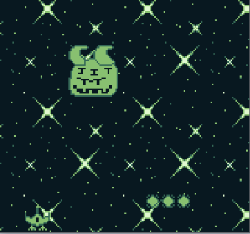
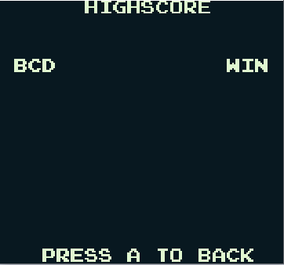
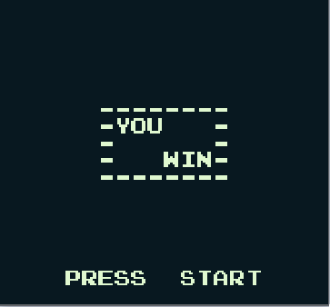

# IHS-Adventure

É um jogo para GameBoy desenvolvido em C. O jogo se baseia em controlar uma nave e destruir os inimigos. Elementos presente no jogo:

- Background com efeito parallax.
- Efeitos Sonoros (Noises).
- Música.
- Chefes Personalizados.
- Highscore.

# Como jogar?

Para carregar a **ROM** é necessário ter um GameBoy ou um emulador. No nosso projeto foi utilizado o [BGB emulator](https://bgb.bircd.org/). No emulador carregue a **ROM** [main.gb](https://github.com/tanjirino/projeto-ihs-adventure/blob/master/main.gb). Selecione a opção **Start** e pressione **Enter**.

# Imagens do Jogo
| **Tela Inicial**            | **Fase 1**      | **Fase 2**     |
|:-------------------------:|:-------------------------------:|:--------------------------------:|
|  |  |  |

| **Highscore**            | **Tela Final**      | 
|:-------------------------:|:-------------------------------:|
|  |  |

# Link para a Demonstração

- [Vídeo](https://youtu.be/t2I1-8q-pkE)

# Referências
- [Writing your first GameBoy game](https://medium.com/@ulrikdamm/writing-your-first-gameboy-game-4ea62c76db29)
- [GBDK 2020](https://github.com/Zal0/gbdk-2020)
- [GameBoy Dev'rs](http://www.devrs.com/gb/)
- [gingemonster](https://github.com/gingemonster/GamingMonstersGameBoySampleCode)

